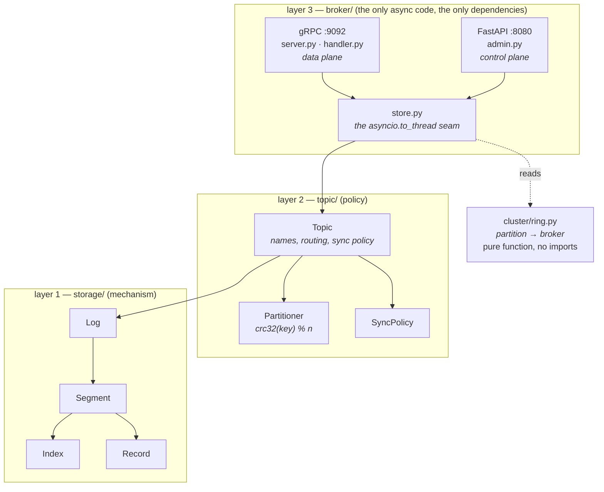
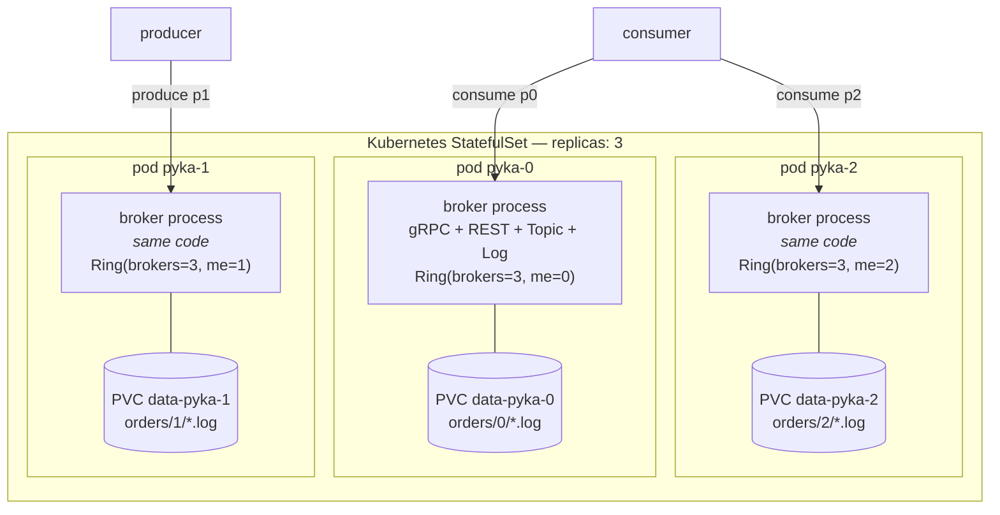
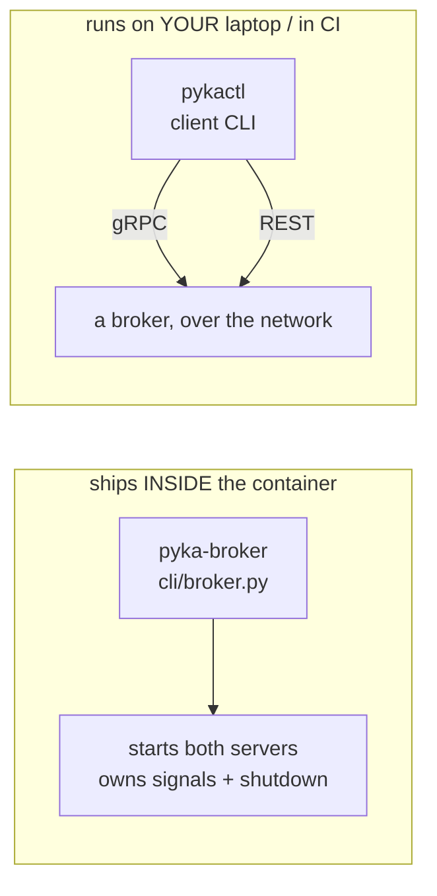
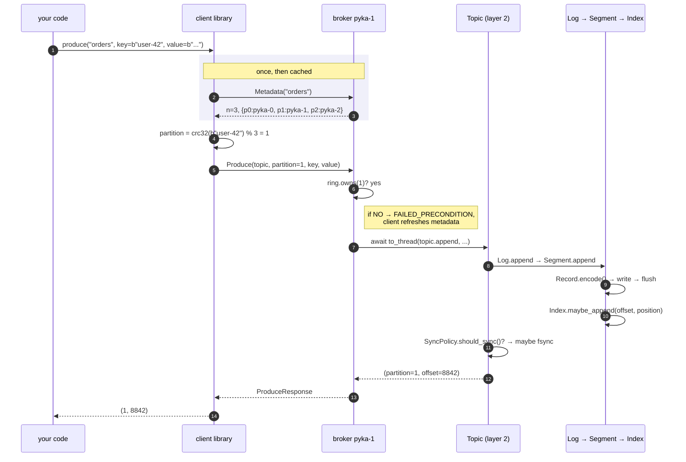
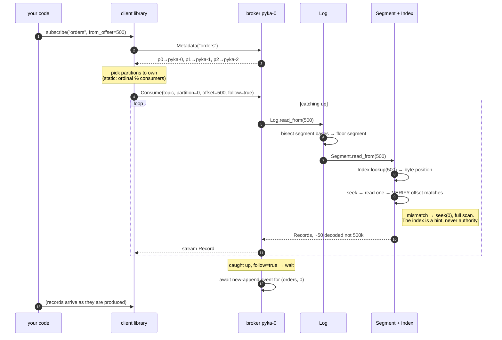
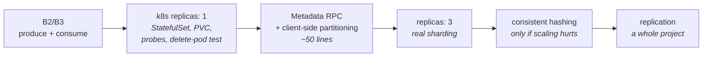

# pyKA architecture — who talks to whom

Written to answer four questions that kept tangling: where the frameworks
live, what "cluster" actually *is*, where the CLI belongs, and what happens
end to end when a record is produced and consumed.

---

## 1. `cluster/` is not a layer above the others

An early draft of this project drew four layers with `cluster/` on top. The
code says otherwise:

```
$ grep -rn "from pyka" src/pyka/cluster/     →  nothing
$ grep -rn "from pyka.cluster" src/          →  broker/store.py, cli/broker.py
```

`cluster/` imports **nothing** and is imported **by** the broker. It is a leaf
dependency — a lookup table — not a tier above anything. Nothing in it ever
calls a broker, a topic, or a log.

The honest picture:



**Both frameworks are layer 3.** One layer, two protocols, split by traffic
profile:

| | gRPC :9092 | FastAPI :8080 |
|---|---|---|
| plane | data | control |
| callers | producers, consumers | humans, `curl`, k8s probes |
| shape | long-lived streams | CRUD request/response |
| frequency | thousands/sec | a few a day |
| wants | raw bytes, backpressure | OpenAPI docs, readable errors |

They share one `Store`, and **must** — `Segment` holds an exclusive write
handle, so two processes on one data directory would each believe they owned
the tail.

---

## 2. A cluster is a topology, not a component

This is the misconception worth killing. There is no cluster server, no
cluster object, no cluster endpoints. **A cluster is N copies of the identical
broker process, each with its own disk.**



Every box inside the cluster runs the **same image**. The only difference is
two integers — `me` and `brokers` — read from the hostname and an env var.

So `Ring` is not a service anyone calls. It is a formula every broker
evaluates locally, and because the inputs are identical everywhere, the
answers are identical everywhere. **That is what replaces consensus in this
design.** Agreement by construction.

What that means concretely:

- **no** cluster server to write
- **no** cluster endpoints to design
- **no** cluster objects beyond the 35-line `Ring`
- **yes:** one new RPC on the *existing* broker: `Metadata`, which every broker
  answers identically

---

## 3. Where the CLI belongs — there are two of them

Conflating these is part of the confusion.



**`pyka-broker` is not a client.** It is the process entry point — the thing a
container's `CMD` runs. It belongs with layer 3 because it *is* layer 3's
bootstrap.

**A client CLI is not in any layer**, because it does not run on the broker at
all. It is a separate program that speaks the wire protocol. It needs exactly
three things:

1. the generated gRPC stubs (`pyka.v1`)
2. the partitioner, `crc32(key) % n` — **the same function the server uses**
3. a `Metadata` call to learn `n` and the broker addresses

And **no** client needs `Ring`. `Ring` maps partition → broker *ordinal*; a
client wants partition → *address*, which is what `Metadata` returns. The
client consumes the ring's output, never the ring.

---

## 4. Producing a record, end to end



**Step 6 is the design decision that a cluster forces.** The client picks the
partition, because it must know *which broker to open a socket to* — and you
can only know that after you know the partition. A broker receiving someone
else's partition would have to forward it: two network hops per record.

With one broker this degenerates harmlessly: every partition is local, so a
client that skips metadata and lets the server route is correct.

**Implemented.** `ProduceRequest` carries `optional int32 partition`: absent
means "server, you choose" (convenient on a single broker), present means "I
already routed this, verify you own it". Either way the broker checks
ownership and answers `FAILED_PRECONDITION` — naming the right broker and its
address — when the partition is not its own.

---

## 5. Consuming, end to end



Note what is **absent**: the partitioner. A consumer names its partition —
it was assigned one — so reads never route by key. Partitioning is an
append-side concern only.

**Built as of B3**, minus the waiting: the stream reads in batches of 500 and
ends when the log does. Errors split three ways — `NOT_FOUND` for an unknown
topic, `INVALID_ARGUMENT` for a bad partition or name, and `OUT_OF_RANGE` for
an offset before the log starts, which is a consumer's signal to reset rather
than retry.

> **Open design (B4):** "wait for new appends" needs a notification. The
> natural shape is an `asyncio.Event` per (topic, partition) that `append`
> sets and waiting streams await. Polling would work and be uglier.
>
> The wrinkle: `append` runs in a worker thread (via `to_thread`) while the
> waiting stream is on the event loop, and `asyncio.Event` is **not**
> thread-safe. The signal has to cross with `loop.call_soon_threadsafe`.

---

## 6. Is the cluster actually necessary?

Honestly: **no, not for what this project is for.**

| goal | needs a cluster? |
|---|---|
| learn Kubernetes: StatefulSet, PVC, probes, identity, rolling updates | **no** — `replicas: 1` teaches all of it |
| learn the log: segments, index, recovery | no |
| learn gRPC streaming, backpressure | no |
| capacity beyond one disk | yes |
| survive a broker dying | **cluster is not enough** — needs replication |

That last row matters. Sharding across brokers buys *capacity*, not
availability. Without replication, `pyka-1` being down means `orders/1` is
unreachable, full stop. A "cluster" that doesn't survive a node failure is
often not what people mean by the word, so it should be named precisely:
**a sharded cluster with no high availability.**

### Recommended sequence



Steps 1–2 are the highest value per hour. Step 3 is cheap and is where the
`Ring` commit stops being speculative. Step 4 is a config change once 3 is
done. Steps 5–6 only if the pain is real.

---

## 7. Summary — the four answers

1. **FastAPI and gRPC are both layer 3.** Two protocols, one layer, split by
   traffic profile. They share one `Store` and must live in one process.
2. **The cluster is not a layer.** It is N identical broker processes. It gets
   no server and no endpoints of its own — only one extra RPC (`Metadata`) on
   the broker that already exists. `cluster/ring.py` is a leaf library the
   broker reads, which is why our layer diagram had it upside down.
3. **`pyka-broker` is layer 3's bootstrap**, not a client. A client CLI lives
   outside every layer and needs only the stubs, the partitioner, and
   `Metadata`.
4. **Produce routes by key on the client; consume names its partition.** That
   asymmetry is why the partitioner is called on exactly one path.
